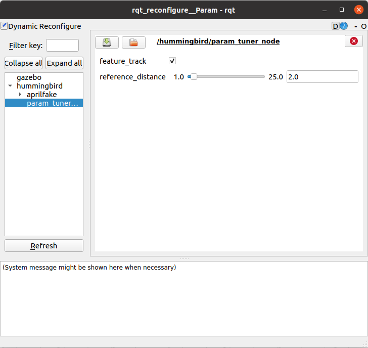

# Perception-Aware Image-Based Visual Servoing of Aggressive Quadrotor UAVs

## Paper

If you use this code in an academic context, please cite the following

Qin, Chao, Qiuyu Yu, HS Helson Go, and Hugh H-T. Liu. "Perception-Aware Image-Based Visual Servoing of Aggressive Quadrotor UAVs." IEEE/ASME Transactions on Mechatronics (2023).

Bibtex:
```
@article{qin2023perception,
  title={Perception-Aware Image-Based Visual Servoing of Aggressive Quadrotor UAVs},
  author={Qin, Chao and Yu, Qiuyu and Go, HS Helson and Liu, Hugh H-T},
  journal={IEEE/ASME Transactions on Mechatronics},
  year={2023},
  publisher={IEEE}
}
```

## I. Overview

This IBVS control algorithm is designed for aggressive quadrotors to ensure target visibility during agile flight.

**Authors**: Chao Qin, QIuyu Yu, Helso Go, and Hugh H.-T. Liu from [FSC lab](https://www.flight.utias.utoronto.ca/fsc/)

**Paper**: [Perception-Aware Image-Based Visual Servoing of Aggressive Quadrotor UAVs](https://ieeexplore.ieee.org/abstract/document/10140151), Qin, Chao; Yu, Qiuyu; Go, Shing Hei Helson; Liu, Hugh H. -T., in IEEE/ASME Transactions on Mechatronics, 2023

**Video Links**: [youtube](https://www.youtube.com/watch?v=wvtgll-iRx4)

<a href="https://www.youtube.com/watch?v=wvtgll-iRx4" target="blank">
  <p align="center">
    
  </p>
</a>


## II. Installation

### Get ROS

This framework is based on the Robot Operating System ([ROS](http://www.ros.org/)) and you therefore first need to install it (Desktop-Full Install) by following the steps described in the [ROS Installation](http://wiki.ros.org/ROS/Installation).

### Get catkin tools

Get catkin tools with the following commands:

```
sudo apt-get install python-pip
sudo pip install catkin-tools
```

### Create a catkin workspace

Create a catkin workspace with the following commands by replacing `<ROS VERSION>` with the actual version of ROS you installed:

```
cd
mkdir -p catkin_ws/src
cd catkin_ws
catkin config --init --mkdirs --extend /opt/ros/$ROS_DISTRO --merge-devel --cmake-args -DCMAKE_BUILD_TYPE=Release
cd src
```

### Get catkin_simple

```
git clone https://github.com/catkin/catkin_simple
```


### Get eigen_catkin

```
git clone https://github.com/ethz-asl/eigen_catkin
```
### Get mav_comm

```
git clone https://github.com/ethz-asl/mav_comm
```

### Get rotors_simulator

```
git clone https://github.com/ethz-asl/rotors_simulator
```

### Clone this repository:

```
git clone https://github.com/FSC-Lab/fsc_aggressive_ibvs
```

### Configure RotorS

```
mv fsc_aggressive_ibvs/utils/mav_fpv_sensor.gazebo rotors_simulator/rotors_description/urdf
```

We modify the weight of the simulated camera to zero for better visualization. At the ```<!-- VI-Sensor Macro -->``` in```src/rotors_simulator/rotors_description/urdf/component_snippets.xacro```

change ```<mass value="0.13" />``` to ```<mass value="0.0" />```


### Compile the source code

```
cd ..
catkin build
```

The source file to generetate MPC C codes using acados can be found in `utils/pose_track_mpc.cpp`

## III. Target Tracking Simulation

```
source devel/setup.bash
roslaunch fsc_autopilot run_autopilot_rotors_planning.launch 
```

Click feature track to switch the control from position control to our IBVS

<p align = "center">

</p>

Specify the desired distance 

<p align = "center">

</p>

And you will see the resulting flight trajectory in rviz. From the image in the left corner, we can see that our controller strives to maintain the target visual feature within the specified rectangular image bound.

<p align="center">
    
</p>

## IV. Acknowledgment
Our implementation is based on [rpg_quadrotor_control](https://github.com/uzh-rpg/rpg_quadrotor_control
) and [rpg_mpc](https://github.com/uzh-rpg/rpg_mpc).

We use [ACADO](https://acado.sourceforge.net/doc/html/db/d4e/tutorial.html) as our NMPC solver.

We use [RotorS](https://github.com/ethz-asl/rotors_simulator) for quadrotor simulation.
